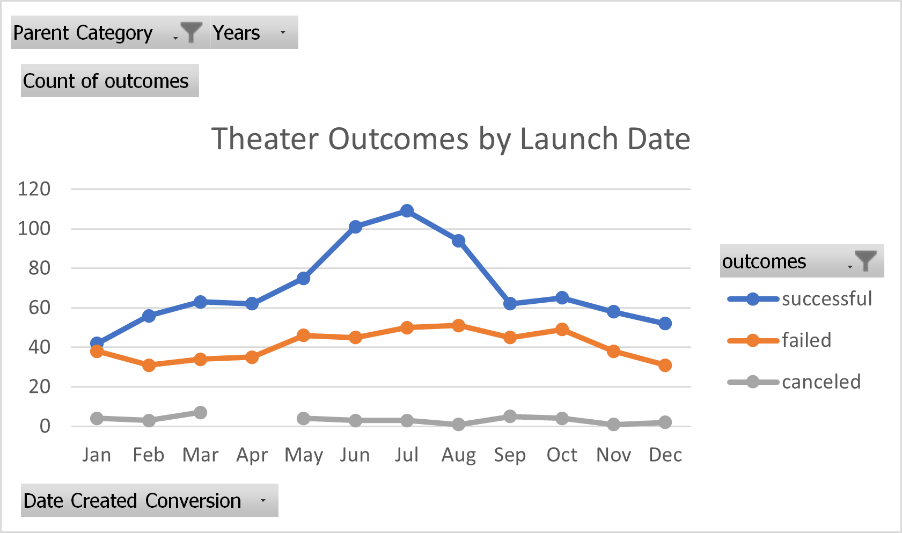
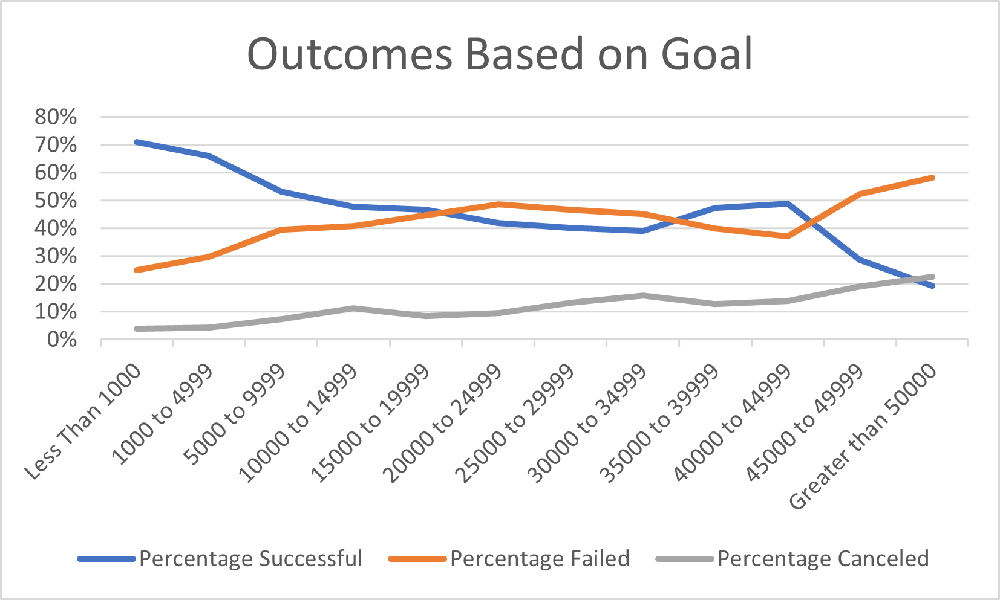

# kickstarter-analysis

## Overview of Project
  The purpose of this project was to use the skills we had learned throughout the module to clean, organize, and arrange the data in such a way that allows us to analyze it. We are given a large dataset of different categories of kickstarters from various parts of the world. We can try to see what makes one type of kickstarter more successful than the other, whether it be a particular categorie or how high (or low) a goal affects the outcome. This information is of high value for anyone who will seek to do a kickstarter of their own in the future to help ensure their succcess.
  
## Analysis and Challenges
  An analysis of the outcomes of theater kickstarters was done with a breakdown by month, this will allow us to determine if a particular time of year is more beneficial to do a kickstarter for anyone interested in theater.
  
  
  
  Later, an analysis of outcomes based on their goals was performed to facilitate in understanding what goal, regardless of category, will ensure high levels of success.
  
  
  
  The largest difficulty I faced was being able to successfully create the formulas that would allow me to drag and replicate it with different criterias. This would assist me with being able to perform the analysis quickly instead of slowly typing out the functions. The way I overcame it was by first carefully writing out the functions for the number of successful goals, then dragging it across to failed and canceled. From there, I used the replace function to quickly replace the word "successful" with whichever word I required. This allowed me to complete much quicker than previously needed.
 
## Results

  The two conclusions I discovered for theater outcomes by launch date are:
    1. There is a higher chance of success in the months of June, July, and August. While kickstarts in December and January have the lowest chance for success. This is possibly due to people feeling more joyful or energetic in the Summer months.
    2. Failed outcomes were rather steady, regardless of the time of year.
  
  The conclusion I arrived from the Outcomes based on Goals is once they exceeded 40,000 their percentages of failure also increased. This tells us that it is easier to have success when the goal to reach is lower, especially 9,999 and below has a more than 50% chance of success.
  
  The largest limitation of this dataset is that there are various currencies from different parts of the world. It makes it very difficult to analysis anything relating to comparisions in financial outcomes since there is no reference point. I would recommend an exchange into one currency, such as USD to take into account for the different exchange rates. This would be ideal to measure the success of all the kickstarters when it comes to money.

